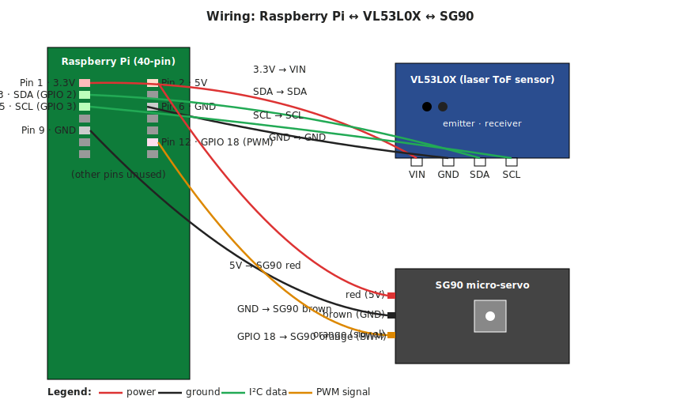
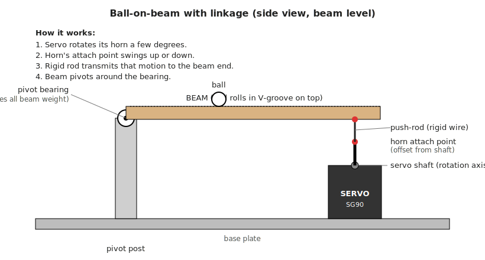
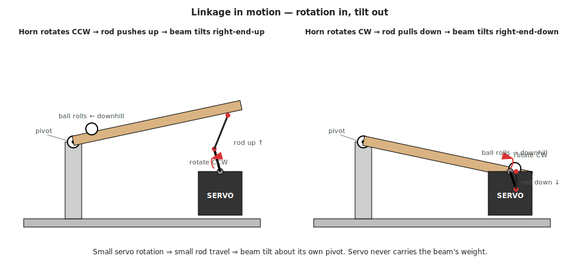
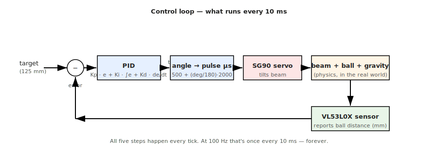

# Hardware: build a physical PID demo

A companion to the simulation in this folder. Once you've felt how P / I / D behave in the TUI, the next step is wiring up the same loop to real hardware so the physics happens in the real world instead of being integrated by `pendulum.py`.

This doc covers what to build for a first physical PID demo, given the constraints of being in Singapore with an Arduino / ESP / Raspberry Pi already on hand and access to Sim Lim Square + a home 3D printer.

## Pick: ball-on-beam (1D)

A short beam pivots in the middle (or near one end). A servo tilts the beam. A ball rolls along a groove on the beam. A distance sensor at one end tells you where the ball is. The PID adjusts the tilt angle to keep the ball at a target position. You poke the ball with your finger as the disturbance and watch the controller fight back.

It's the same feel as the pendulum sim, but the unstable axis is "ball wants to roll off" instead of "pendulum wants to fall."

### Why this over the alternatives

- **Ball-in-tube (fan version):** needs a clear acrylic tube (annoying to source — hardware stores at Bras Basah have them but you'll be hunting), a 12 V PC fan with PWM, a MOSFET to drive it, and a 12 V supply. More electrical complexity for the same lesson.
- **Self-balancing two-wheel robot:** needs an MPU6050 + sensor fusion + two motor drivers + wheels + chassis tuning. You'll spend a weekend on hardware before you ever tune a PID.
- **Maglev:** electromagnets, hall sensor, and a ~kHz control loop. Cool, but the timing is unforgiving for a first build.

## Bill of materials (~S$15–20)

| Part | Where | Approx S$ |
|---|---|---|
| SG90 micro-servo (or MG90S for metal gears / less slop) | Sim Lim — hobby electronics shops on L3 / L4 | 3–6 |
| VL53L0X laser ToF distance sensor (preferred over HC-SR04 ultrasonic) | Sim Lim, same shops | ~8 |
| Ping-pong ball | Decathlon / any sports shop | 1 |
| Jumper wires + breadboard | Probably already on hand | – |
| Raspberry Pi (any model with 40-pin header) | Already on hand | – |
| 5 V power (USB is fine for an SG90) | Already on hand | – |

## What to 3D-print

- A **beam** with a small V-groove or rail down the length so the ball tracks straight and doesn't fall off sideways. Length ~20–30 cm.
- **Pivot post(s)** that hold the beam on its own bearing (a skate bearing, a brass bushing, or an M3 screw will do).
- A **servo mount** that holds the servo upright on the base, off to one side of the beam.
- A **push-rod** (or just use a stiff piece of straight wire bent into a Z at each end — paperclip works for prototyping).
- A **base plate** to tie it all together.

Total print time roughly 1–2 hours.

## The sensor: VL53L0X (laser time-of-flight)

There are two common cheap distance-sensor options for this build. The doc previously listed the HC-SR04 ultrasonic; we're going with the VL53L0X instead.

**HC-SR04 (ultrasonic).** A ~40 kHz sound pulse and an echo timer. Looks like a board with two metal cylinders ("eyes"). Range 2 cm – 4 m, ~S$2, dead-simple Trig/Echo pins on 5 V. Downsides: that 2 cm dead zone bites on a short beam, readings are noisy, and it reflects oddly off curved/soft surfaces like a ping-pong ball.

**VL53L0X (laser ToF).** Same idea but with an invisible IR laser instead of sound. A small chip with an emitter and a receiver window. Range ~3 cm – 1.2 m, much more precise, faster (~50 Hz), and indifferent to surface acoustics. ~S$8, talks over I²C (SDA/SCL), runs on 3.3 V or 5 V. The tradeoff is one extra concept to learn (I²C) versus the dead-simple Trig/Echo of the ultrasonic.

For this project the VL53L0X is worth the extra S$5 — cleaner data and faster loop are both more useful than the savings.

## The processor: Raspberry Pi vs. ESP32

Either works. The honest tradeoffs:

**ESP32** is a microcontroller. The PID loop runs deterministically, PWM to the servo is hardware-clean, boots in milliseconds. ~S$8 if you don't already own one. Best choice on technical merit.

**Raspberry Pi** is a full Linux computer. Two consequences:

- Loop timing has *some* jitter because Linux preempts you. For a 50–200 Hz ball-on-beam loop this is fine — the ball doesn't move that fast — you just won't get the rock-solid 1 kHz an ESP32 could squeeze out.
- Software PWM on a Pi jitters enough that an SG90 visibly twitches. Fix: use `pigpio` (DMA-based PWM, very stable), use GPIO 18 which has hardware PWM, or add a **PCA9685** servo-driver board over I²C (~S$3 at Sim Lim, overkill for one servo but bulletproof).

Upside of the Pi: you write Python directly, you can `ssh` in, log to disk, plot live with matplotlib, reuse your sim code almost verbatim. For learning, that's nicer.

**Going with the Pi.** Servo driven from GPIO 18 via `pigpio`; ~100 Hz loop.

## Wiring



### VL53L0X → Pi (I²C)

| VL53L0X pin | Pi pin (physical) | Pi function |
|---|---|---|
| VIN | pin 1 | 3.3 V |
| GND | pin 6 | GND |
| SDA | pin 3 | GPIO 2 (I²C1 SDA) |
| SCL | pin 5 | GPIO 3 (I²C1 SCL) |

XSHUT and GPIO1 on the breakout — leave disconnected.

Then:

```
sudo raspi-config        # Interface Options → I²C → Enable, then reboot
sudo apt install i2c-tools python3-pip
i2cdetect -y 1           # should show "29" — that's the sensor's address
pip install adafruit-circuitpython-vl53l0x
```

Quick sanity test:

```python
import board, busio, adafruit_vl53l0x
i2c = busio.I2C(board.SCL, board.SDA)
sensor = adafruit_vl53l0x.VL53L0X(i2c)
while True:
    print(sensor.range, "mm")
```

### SG90 → Pi (PWM)

| SG90 wire | Pi pin | Notes |
|---|---|---|
| Brown (GND) | pin 9 (or any GND) | must share ground with Pi |
| Red (5 V) | pin 2 (5 V) | OK for one SG90; if it browns out the Pi, use a separate 5 V supply with GND tied to Pi GND |
| Orange (signal) | pin 12 (GPIO 18) | hardware PWM channel |

Then on the Pi:

```
sudo apt install pigpio python3-pigpio
sudo systemctl enable --now pigpiod
```

```python
import pigpio
pi = pigpio.pi()
pi.set_servo_pulsewidth(18, 1500)   # 1500 µs = center; 500 = full one way, 2500 = full the other
```

## Mechanical architecture: the linkage

A foot-long beam mounted *directly* on an SG90 horn will eventually strip the servo's plastic gears — not because the servo is short on torque (it has ~50× more than it needs), but because the **side load** on the tiny output shaft is what hobby servos are weakest against. The fix is mechanical, not "buy a bigger servo":

- **The beam pivots on its own bearing**, on a post. That bearing carries the beam's weight.
- **The servo lives separately on the base** and connects to one end of the beam via a short rigid **push-rod**.
- The servo never carries the beam. Its job is purely "push the rod up a bit / pull it down a bit."

Think of it like a drawbridge: the bridge is hinged on the bank, and a winch on the bank raises/lowers the far end via a stiff rod.

### Overview



### How it converts rotation into tilt

The rod attaches to the servo horn at a point that's *offset* from the servo's rotation axis. As the horn rotates a few degrees, that attach point swings up or down in a small arc — effectively translating the rotation into linear motion of the rod. The rod then pushes or pulls the far end of the beam, which pivots about its own bearing.



### If you want to skip the linkage

If you really want to mount the beam straight on the servo (simpler, less to print), swap the servo:

| Servo | Torque | Gears | Sim Lim ~S$ | Verdict for direct-mount foot-long beam |
|---|---|---|---|---|
| SG90 | 1.8 kg·cm | plastic | 3 | Works briefly, gears wear from side load |
| **MG90S** | 2.2 kg·cm | **metal** | 5 | Drop-in replacement, same size, fixes the gear-strip problem |
| MG996R | 11 kg·cm | metal | 8 | Overkill, bigger footprint, bulletproof |

Recommendation: keep the SG90 and design with a linkage. You'll learn more from getting the mechanical architecture right than from throwing a beefier servo at a side-loading problem.

## The control loop



There is no event hook. The Pi just polls the sensor ~100 times per second and runs four steps every tick:

```python
while True:
    distance = sensor.range            # 1. read
    error = target - distance          # 2. compare
    output = pid.update(error, dt)     # 3. think
    servo.set_angle(90 + output)       # 4. act
    sleep(dt)                          # 5. wait one tick
```

That polling loop *is* the controller.

### From PID output to servo PWM

The PID emits a single number per tick. You decide what it represents — for a servo the cleanest choice is **degrees of beam tilt from level**. Then convert degrees to a pulse width.

The SG90 takes a pulse-width signal: a square wave at 50 Hz where the *width of the high pulse* tells it where to go.

- **500 µs pulse → 0°**
- **1500 µs pulse → 90°** (center)
- **2500 µs pulse → 180°**

Linear, so: `pulse_us = 500 + (angle / 180) × 2000`, which simplifies near center to `pulse_us ≈ 1500 + (angle − 90) × 11.1`.

Hand the result to `pi.set_servo_pulsewidth(18, pulse_us)`; pigpio generates the pulse train in the background via DMA.

### Full loop

```python
import time, pigpio, board, busio, adafruit_vl53l0x
from balance.pid import PID

SERVO_PIN = 18
TARGET_MM = 125
DT = 0.02                     # 50 Hz loop
TILT_LIMIT_DEG = 20

def angle_to_pulse_us(deg):
    deg = max(90 - TILT_LIMIT_DEG, min(90 + TILT_LIMIT_DEG, deg))
    return int(500 + (deg / 180) * 2000)

i2c = busio.I2C(board.SCL, board.SDA)
sensor = adafruit_vl53l0x.VL53L0X(i2c)
pi = pigpio.pi()
pid = PID(kp=0.3, ki=0.0, kd=0.05)

while True:
    distance = sensor.range
    error = TARGET_MM - distance
    tilt_deg = pid.update(error, DT)
    pi.set_servo_pulsewidth(SERVO_PIN, angle_to_pulse_us(90 + tilt_deg))
    time.sleep(DT)
```

The PID doesn't know its output is "degrees" — *you* decide that by how you scale Kp. If Kp = 0.3 and the error is in mm, then a 50 mm error produces a 15° tilt command. Tune Kp until that mapping feels right.

## Loop rate, actuator lag, and why fast ticks are good

An SG90 takes ~100 ms to swing 60°. In one 10 ms tick at 100 Hz, the servo can only physically move ~6°. That sounds like the controller is sending commands faster than the actuator can execute them — and it is. **That's the intended design.**

Each PID output is not "go to this position and arrive there before I ask again"; it's **"this is the position you should currently be heading toward."** The servo doesn't need to *complete* each move — it just bends its trajectory toward the latest target. Because PID outputs change smoothly, each new target is only a tiny adjustment from the previous one, and the servo ends up tracing a continuous curve.

The servo's own slowness acts as a low-pass filter on your commands. That's a feature.

### What actually constrains the tick rate

```
plant dynamics  >>  loop period  ~  actuator response  >>  sensor sample time
(~500 ms)           (10 ms)         (~100 ms)              (~30 ms for VL53L0X)
```

- **Too slow → ball escapes.** Rule of thumb: sample 10–20× faster than the *plant's* dynamics — the ball, not the servo. The ball takes ~half a second to roll off; anything below ~20 Hz feels sluggish, ~100 Hz is comfortable.
- **Too fast → noise amplification.** At 1000 Hz the D-term starts differentiating sensor noise and producing twitchy commands. The servo will mostly smooth them out, but you waste power and wear the gears.

The loop period sits *below* the actuator response on purpose. The servo being "behind" is the system integrating your stream of small corrections into smooth motion.

## Rate limiting and low-pass filtering

Two tools for taming the signal between PID and servo. Both are 2–3 line additions.

### Rate limiter — hard cap on per-tick change

Caps how much the commanded angle is allowed to move in one tick.

```python
MAX_DEG_PER_TICK = 2.0    # at 100 Hz → 200 °/s, roughly the SG90's actual speed
commanded_angle = 90.0    # initial state, OUTSIDE the loop

def rate_limit(target, current, max_step):
    delta = target - current
    if delta >  max_step: return current + max_step
    if delta < -max_step: return current - max_step
    return target

# inside the loop:
desired = 90 + tilt_deg
commanded_angle = rate_limit(desired, commanded_angle, MAX_DEG_PER_TICK)
pi.set_servo_pulsewidth(SERVO_PIN, angle_to_pulse_us(commanded_angle))
```

### Low-pass filter — exponential moving average (EMA)

Blends each new command with the previous filtered value.

```python
ALPHA = 0.3               # 0 = output frozen, 1 = no filtering
filtered_angle = 90.0     # initial state, OUTSIDE the loop

# inside the loop:
desired = 90 + tilt_deg
filtered_angle = ALPHA * desired + (1 - ALPHA) * filtered_angle
pi.set_servo_pulsewidth(SERVO_PIN, angle_to_pulse_us(filtered_angle))
```

The line `new = α·desired + (1−α)·old` is equivalent to a first-order RC low-pass, with cutoff frequency ≈ `α · loop_rate / (2π)`. At 100 Hz with α = 0.3, anything wiggling faster than ~5 Hz gets squashed.

### Which one when

| Symptom | Reach for |
|---|---|
| Servo trying to slam from one extreme to the other on a big error | **Rate limiter** |
| Servo buzzing/twitching from noisy sensor or a hot D-term | **Low-pass filter** |
| Both | Stack them: filter first, then rate-limit the result |

### Gotcha: filtering adds phase lag

Anything between the PID and the servo *delays* the controller's response. Delay is the enemy of stability — too much and the loop oscillates. Filter only as much as you need.

A subtler trick that's often better: filter the **sensor reading** instead of the output. That kills noise at the source before the D-term amplifies it, and costs less phase margin:

```python
filtered_distance = ALPHA * sensor.range + (1 - ALPHA) * filtered_distance
error = TARGET_MM - filtered_distance
tilt_deg = pid.update(error, DT)
```

**Order of operations:**
1. Tune the PID with raw inputs and outputs first. See if it even needs filtering.
2. If the D-term makes the servo buzz → low-pass the *sensor*, α around 0.3–0.5.
3. If the servo hits mechanical limits on large errors → add a rate limiter on the *output*.
4. If you still see oscillation: the issue is gains, not filtering. Lower Kp, lower Kd. Don't filter your way out of bad tuning.

## Limit cycling at balance

At the setpoint, sensor noise causes the servo to twitch with micro-commands forever. The system is mechanically still but the controller is hallucinating motion. This is called **limit cycling**.

When the ball is genuinely at center, the sensor reads e.g. `124, 126, 125, 127, 123, 125…` — ±2 mm of jitter. Each PID term sees this differently:

- **P-term:** error is ~±2 mm. Output is `Kp · 2` — tiny, mostly harmless.
- **I-term:** integrates zero-mean noise → averages to ~zero. Innocent.
- **D-term:** the villain. `derivative = (Δ error) / dt`. A 2 mm flicker over 10 ms reads as **200 mm/s** of phantom ball velocity. Multiply by Kd and the output spikes. Next tick the noise flips sign and the spike flips with it. That's the buzz.

### Fixes, in order

1. **Low-pass the sensor reading.** (See above.) Single most effective.
2. **Deadband on the error.** Declare victory inside ±DEADBAND_MM:
   ```python
   DEADBAND_MM = 3
   if abs(error) < DEADBAND_MM:
       error = 0
   ```
   The cost is a small steady-state offset (ball can sit `DEADBAND_MM` off center before correcting).
3. **Filter the D-term specifically.** Keep P/I fast, smooth only the derivative:
   ```python
   filtered_d = ALPHA_D * raw_derivative + (1 - ALPHA_D) * filtered_d
   ```
4. **Lower Kd.** If you're fighting noise with filters, maybe the gain itself is too aggressive.
5. **The servo's own deadband saves you a bit for free.** SG90s typically ignore pulse-width changes smaller than ~1–2 µs (~0.1°), so the very smallest commands get filtered by physics.

### The mental shift

Treat the resting state as a **range**, not a point. "At center" means "within ±3 mm of center, with bounded twitch." A perfectly still servo at balance is not the goal — a quietly-still-enough servo is. Limit cycling becomes a problem only when the twitch is visible, audible, or starts wearing the servo gears. Below that, leave it alone.

## Two gotchas (now condensed)

1. **VL53L0X dead zone.** Works down to ~3 cm — keep the ball from getting closer than that. Much better than the HC-SR04's 2 cm minimum and also less noisy / faster.
2. **SG90 backlash.** ~1–2° of slop in the gear train. On a 15 cm lever, that's ~3–5 mm of dead zone at the tip. *Good news for learning* — the imperfect actuator makes PID tuning feel real instead of toy-clean. If it bothers you later, swap to MG90S (metal gears, ~S$2 more).

## Porting the simulation code

The controller code in `balance/pid.py` and `balance/recovery.py` ports almost directly. The loop shape is the same:

```
loop:
    measurement = read_sensor()              # was env.state[0]
    out = pid.update(measurement, dt)        # unchanged
    servo.write(setpoint_angle + out.control) # was env.step(...)
    sleep(dt)
```

Things that change vs. the sim:

- `dt` is your loop's real wall-clock period. The "tick rate" is now a real engineering parameter — too slow and the ball escapes.
- Sensor noise is real. Low-pass the measurement before feeding it to the PID.
- The actuator (servo) has its own internal control loop, so you're really commanding a setpoint, not a torque. PID doesn't care.
- Gains will not be the same as the sim. Start from zero, raise Kp until it oscillates, back off, then add Kd, then Ki. Classic Ziegler-Nichols-ish hand-tuning.

## Suggested progression

1. Get the ball to sit still at the centre with **P only** (Ki = Kd = 0). It will oscillate.
2. Add **D** to damp the oscillation. The ball should now hold near centre but may park slightly off if the beam isn't perfectly level.
3. Add **I** to cancel that residual offset.
4. Add disturbance: poke the ball gently and watch the recovery. Port `RecoveryTracker` to count loop iterations from peak displacement to settled.
5. Try varying the loop rate. Run the loop at 20 Hz vs 200 Hz and feel the difference.

That progression mirrors the "experiment with the gains" section of `balance/README.md`.
